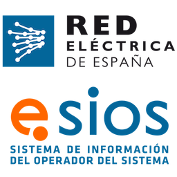

# Home Assistant PVPC Hourly Pricing (Updated)

Custom integration for Home Assistant that retrieves the PVPC (Voluntary Price for Small Consumers) electricity prices in Spain, broken down by hourly periods. Allows using the data in **sensors**, **automations**, and **energy dashboards** in Home Assistant.

> ℹ️ **Release v1.2.0** automates the calculation of holiday dates so it no longer depends on yearly manual updates. Please test it and if you find any issues open an issue so we can fix it as soon as possible. Thank you all for your support! ❤️

---

## 📌 Features

- Retrieves hourly PVPC electricity prices in Spain.
- Generates sensors for each hourly price period.
- Compatible with automations and energy dashboards.
- Lightweight and easy-to-use integration.

---

## ⚙️ Installation (HACS)

1. In Home Assistant, open **HACS → Integrations**.
2. Click the menu ⋮ → **Custom repositories**.
3. Add this repository as a Custom Repository in HACS:
   - **URL:** `https://github.com/oscarrgarciia/HA-PVPC-Updated`
   - **Category:** `Integration`
4. Search for the **Home Assistant PVPC Hourly Pricing Updated** integration in HACS and click **Install**.
5. Restart Home Assistant.
6. Configure the sensors via **Settings → Devices & Integrations**.
7. Search for the **Home Assistant PVPC Hourly Pricing Updated** and click **Install**.

---

## 🔧 Configuration

- No external configuration is required if you only want hourly sensors.
- ⚠️ For it to work correctly, you must first remove any other PVPC integration.

---

## ⚖️ License

MIT License.  
See the [LICENSE](LICENSE) file for more information.

---

## 📖 Documentation

Official repository: [https://github.com/oscarrgarciia/HA-PVPC-Updated](https://github.com/oscarrgarciia/HA-PVPC-Updated)
